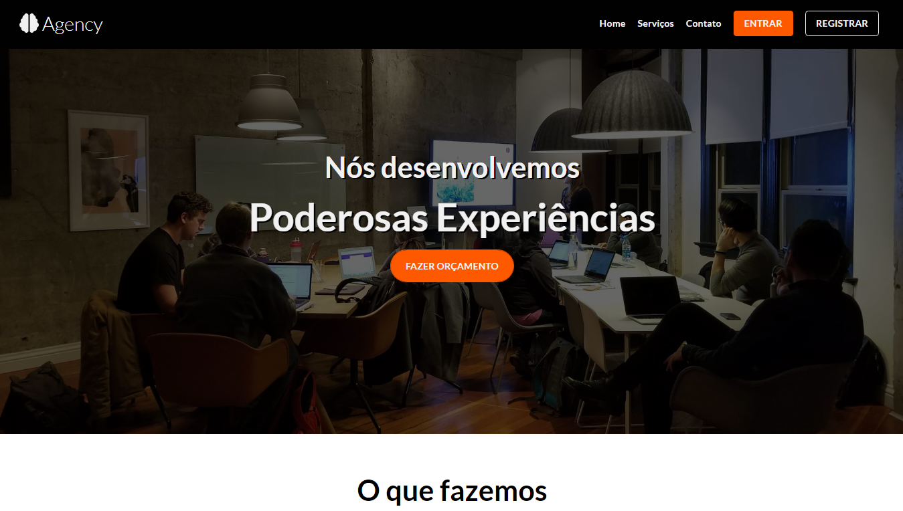

  

<h1 align="center">
    Agency 2.0
</h1>

<h3 align="center">
  Agency 2.0 é uma aplicação que simula um site de uma agencia de desenvolvimento fictícia, eu desenvolvi ela para treinar os conceitos do SASS, React e Typescript
</h4>

    <a href="#🔗-clique-aqui-para-vizualizar-a-página!">Demonstração</a>&nbsp;&nbsp;&nbsp;|&nbsp;&nbsp;&nbsp;
    <a href="#🔨-tecnologias-usadas">Tecnologias usadas</a>&nbsp;&nbsp;&nbsp;|&nbsp;&nbsp;&nbsp;
    <a href="#🎯-features">Features</a>&nbsp;&nbsp;&nbsp;|&nbsp;&nbsp;&nbsp;
    <a href="#📝-licença">Licença</a>

 

### [🔗 Clique aqui para vizualizar a página!](https://agency-2.netlify.app)

  

 

  

https://user-images.githubusercontent.com/71786964/217870274-8314a8a2-4c89-4e2c-bc6e-4a88f6b1f2cd.mp4

>
---

## 🔨 Tecnologias usadas

###

>
---
## 🎯 Features

- Reponsividade 
- Menu responsivo
- Código Limpo

---

## 📝 Licença   

Esse projeto está sob a licença MIT. Veja o arquivo [LICENSE](LICENSE) para mais detalhes.

---

Feito por Mateus Lopes :D ❤   

